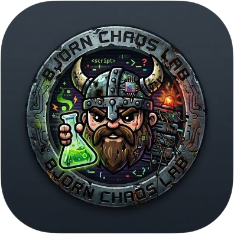

<p align="center">
  
</p>

# Bjorn Chaos Lab

[](LICENSE)   [](https://buymeacoffee.com/infinition)

Automated vulnerable machine deployer for penetration testing training and CTF challenges. Deploys Docker containers with configurable attack surfaces over SSH, managed through a browser UI with real-time feedback.

For use only on systems and networks you own or have explicit authorization to test.

---

## Features

- Multiple vulnerability scenarios: SQL injection, LFI, command injection, unrestricted file upload, misconfigured FTP/SMB/MySQL/SSH/Telnet.
- Privilege escalation challenges: SUID binaries, misconfigured sudo, writable cron jobs.
- Three difficulty levels: Easy (weak passwords, visible flags), Medium (enumeration required), Hard (chained exploits).
- Real-time web UI with live console output via Server-Sent Events.
- Flag system: each scenario plants `BJORN_CTF_*` flags that can be validated from the UI.
- Credential export: download `users.txt` and `passwords.txt` for dictionary attacks.
- Credential upload: push collected credentials to a remote machine via SSH (e.g. a Bjorn device).
- Optional API bearer token authentication.
- Container resource limits (memory + CPU) to prevent host saturation.

---

## Architecture

```
bjorn-chaos-lab/
  lab_engine.py        Core deployment engine (SSH + Docker orchestration)
  lab_server.py        REST API + SSE server (Python stdlib, no framework)
  lab-image/
    Dockerfile         Ubuntu 22.04 victim image with all services
    start.sh           Service initialization
  web/
    index.html         Browser UI
    style.css          Y2K terminal theme
    app.js             Frontend logic (vanilla JS, no dependencies)
```

Backend: Python 3.8+ with `paramiko` for SSH.

Frontend: Vanilla JS with SSE for real-time streaming. No build step.

Container platform: Docker with macvlan networking for realistic network-level simulation.

---

## Requirements

- Python 3.8+
- Docker with macvlan support
- `paramiko`: `pip install paramiko`
- A host running Docker reachable over SSH from the lab server

---

## Running

```bash
pip install paramiko
python lab_server.py
```

Open the UI at `http://localhost:8080`.

---

## Star History

<a href="https://www.star-history.com/?repos=infinition%2Fbjorn-chaos-lab&type=date&legend=top-left">
 <picture>
   <source media="(prefers-color-scheme: dark)" srcset="https://api.star-history.com/chart?repos=infinition/bjorn-chaos-lab&type=date&theme=dark&legend=top-left" />
   <source media="(prefers-color-scheme: light)" srcset="https://api.star-history.com/chart?repos=infinition/bjorn-chaos-lab&type=date&legend=top-left" />
   
 </picture>
</a>

---

## License

MIT. See [LICENSE](LICENSE).
